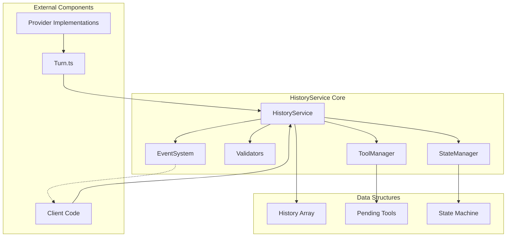
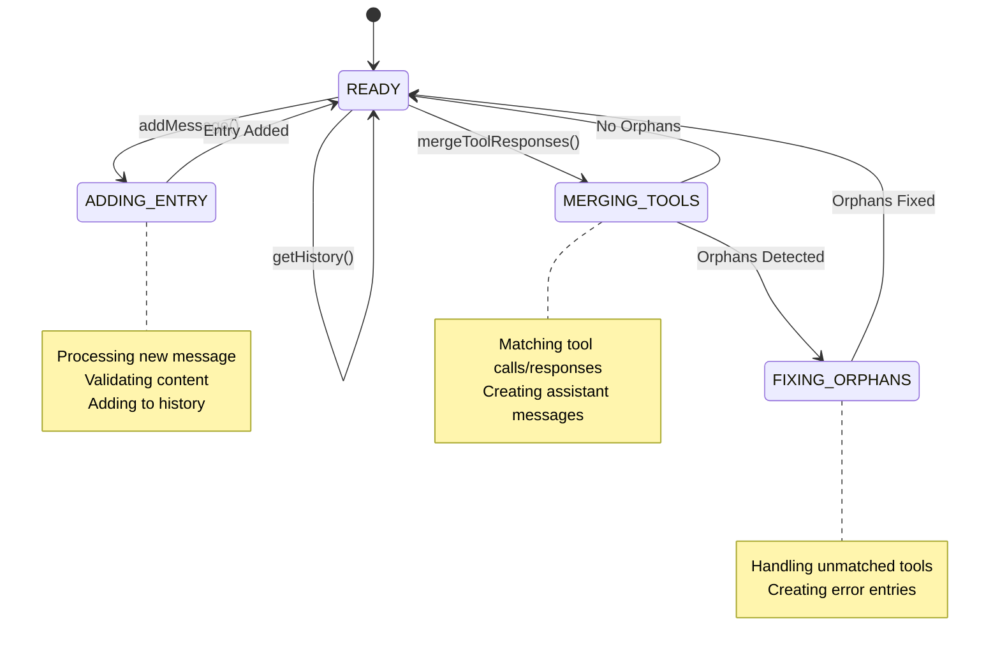

# HistoryService Architecture Diagrams

## 1. Overall Architecture



## 2. State Machine Flow



## 3. Component Interactions

### Adding Model Response
```
Client          HistoryService      StateManager      Validators      EventSystem
  |                   |                   |                |               |
  |--addMessage()---->|                   |                |               |
  |                   |--setState(ADDING)->|                |               |
  |                   |                   |                |               |
  |                   |--validate()-------|--------------->|               |
  |                   |<------------------|----------------|               |
  |                   |                   |                |               |
  |                   |--addToHistory()   |                |               |
  |                   |                   |                |               |
  |                   |--emit('added')----|----------------|-------------->|
  |                   |                   |                |               |
  |                   |--setState(READY)->|                |               |
  |<--Success---------|                   |                |               |
```

### Adding Tool Calls
```
Turn            HistoryService      ToolManager      StateManager      EventSystem
  |                   |                  |                |                |
  |--addToolCalls()-->|                  |                |                |
  |                   |--setState()------|--------------->|                |
  |                   |                  |                |                |
  |                   |--addPending()---->|                |                |
  |                   |<------------------|                |                |
  |                   |                  |                |                |
  |                   |--emit('pending')--|----------------|--------------->|
  |                   |                  |                |                |
  |<--Tool IDs--------|                  |                |                |
```

### Merging Tool Responses
```
Turn            HistoryService      ToolManager      StateManager      EventSystem
  |                   |                  |                |                |
  |--mergeTools()---->|                  |                |                |
  |                   |--setState()------|--------------->|                |
  |                   |                  |                |                |
  |                   |--matchTools()---->|                |                |
  |                   |<--Matched---------|                |                |
  |                   |                  |                |                |
  |                   |--createMessage()  |                |                |
  |                   |--addToHistory()   |                |                |
  |                   |                  |                |                |
  |                   |--checkOrphans()-->|                |                |
  |                   |<--Orphans?--------|                |                |
  |                   |                  |                |                |
  |                   |--setState()------|--------------->|                |
  |                   |--emit('merged')---|----------------|--------------->|
  |<--Success---------|                  |                |                |
```

## 4. Data Flow

```
┌─────────────────────────────────────────────────────────────┐
│                         Input Flow                           │
├─────────────────────────────────────────────────────────────┤
│ User Message → Client → HistoryService → History Array      │
│                                                              │
│ Model Response → Provider → Turn → HistoryService → History │
│                                                              │
│ Tool Call → Provider → Turn → ToolManager → Pending Queue   │
│                                                              │
│ Tool Response → Turn → ToolManager → History (via merge)    │
└─────────────────────────────────────────────────────────────┘

┌─────────────────────────────────────────────────────────────┐
│                        Output Flow                           │
├─────────────────────────────────────────────────────────────┤
│ History Array → HistoryService → Client (getHistory)        │
│                                                              │
│ History Array → HistoryService → Turn → Provider            │
│                                                              │
│ Events → EventSystem → Subscribers (logging, debugging)      │
└─────────────────────────────────────────────────────────────┘
```

## 5. Key Method Mappings

### Standardized Method Names
- **Adding Operations:**
  - `addMessage()` - Add any message to history
  - `addToolCalls()` - Add pending tool calls
  - `addToolResponses()` - Add tool responses

- **Merging Operations:**
  - `mergeToolResponses()` - Main merge operation
  - `matchToolsToResponses()` - Internal matching logic
  - `createAssistantMessage()` - Create merged message

- **State Operations:**
  - `setState()` - Change state
  - `getState()` - Get current state
  - `validateTransition()` - Check if transition allowed

## 6. Error Handling Flow

```
┌──────────────┐     ┌──────────────┐     ┌──────────────┐
│   Validation │     │    State     │     │   Recovery   │
│    Failure   │────▶│   Rollback   │────▶│   Action     │
└──────────────┘     └──────────────┘     └──────────────┘
        │                    │                     │
        ▼                    ▼                     ▼
   Log Error          Restore State         Return Error
   Emit Event         Clear Pending         Suggest Fix
```

## 7. Integration Points

### Turn.ts Integration
- Turn calls `addToolCalls()` when receiving tool calls
- Turn calls `addToolResponses()` when tools complete
- Turn calls `mergeToolResponses()` to create assistant message
- Turn uses `getHistory()` for provider context

### Provider Integration
- Providers receive `Content[]` arrays (no HistoryService access)
- Translation happens in Turn.ts before provider calls
- Responses translated back to common format

### StateManager Integration
- All state changes go through StateManager
- StateManager validates transitions
- StateManager emits state change events
- StateManager maintains state history for debugging