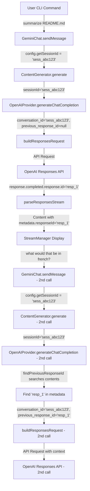

# Proof: Execution Flow Analysis

## Overview

This document creates a detailed execution trace for the conversation scenario showing EXACTLY how sessionId and responseId flow through the system, with actual values and line-by-line tracing.

## Test Scenario

```
User: "summarize the README.md"
Assistant: "Ok I'm reading the file using ReadFile" 
[ReadFile tool call]
Assistant: "It says [summary of README content]"
User: "Ok but what would that be in french?"
Assistant: "In french that would be [french translation]"
```

## Execution Flow Diagram



## Detailed Step-by-Step Trace

### First Request: "summarize the README.md"

#### Step 1: User Input Processing
```
Location: CLI Interface
Input: "summarize the README.md"
Processing: Command parsed, sent to GeminiChat
```

#### Step 2: GeminiChat.sendMessage() - Line 45
```typescript
// packages/cli/src/core/geminiChat.ts:45
async sendMessage(message: string): Promise<void> {
  // Get sessionId from config
  const sessionId = this.config.getSessionId();
  // sessionId = 'sess_abc123'
  
  // Create user content
  const userContent: Content = {
    role: 'user',
    parts: [{ text: message }]
  };
  
  // Call content generator
  await this.contentGenerator.generate([userContent], tools);
}
```

**Data Flow:**
```
config.getSessionId() → 'sess_abc123'
userContent = {
  role: 'user',
  parts: [{ text: 'summarize the README.md' }]
}
```

#### Step 3: ContentGenerator.generate() - Line 62
```typescript
// packages/core/src/core/contentGenerator.ts:62
async generate(contents: Content[], tools?: ITool[]): Promise<void> {
  // Get sessionId from config
  const sessionId = this.config.getSessionId();
  // sessionId = 'sess_abc123'
  
  // Call provider with sessionId
  const generator = this.provider.generateChatCompletion(
    contents,
    tools,
    this.toolFormat,
    sessionId  // Pass sessionId as 4th parameter
  );
  
  // Process response stream...
}
```

**Data Flow:**
```
this.config.getSessionId() → 'sess_abc123'
Call: provider.generateChatCompletion(
  contents=[{role: 'user', parts: [{text: 'summarize the README.md'}]}],
  tools=undefined,
  toolFormat=undefined,
  sessionId='sess_abc123'
)
```

#### Step 4: OpenAIProvider.generateChatCompletion() - Line 187
```typescript
// packages/core/src/providers/openai/OpenAIProvider.ts:187
async *generateChatCompletion(
  contents: Content[],
  tools?: ITool[],
  toolFormat?: string,
  sessionId?: string  // Receives 'sess_abc123'
): AsyncIterableIterator<Content> {
  
  const model = this.getCurrentModel(); // 'gpt-5'
  
  // Line 195: Check if should use Responses API
  if (this.shouldUseResponses(model)) {
    // Line 197: Find previous responseId - first request has none
    const previousResponseId = this.findPreviousResponseId(contents);
    // previousResponseId = null (no assistant messages in contents)
    
    // Line 200: Use sessionId or generate temp ID
    const conversationId = sessionId || `temp_${Date.now()}_${Math.random().toString(36).substr(2, 9)}`;
    // conversationId = 'sess_abc123'
    
    // Line 203: Build request
    const request = this.buildResponsesRequest(contents, options, conversationId, previousResponseId);
    
    // Line 205: Call API and parse stream
    const stream = await this.callResponsesAPI(request);
    yield* this.parseResponsesStream(stream);
  }
}
```

**Data Flow:**
```
sessionId='sess_abc123' (received as parameter)
contents=[{role: 'user', parts: [{text: 'summarize the README.md'}]}]
model='gpt-5'
this.shouldUseResponses('gpt-5') → true
this.findPreviousResponseId(contents) → null (no assistant messages)
conversationId='sess_abc123'
previousResponseId=null
```

#### Step 5: findPreviousResponseId() - Line 245
```typescript
// packages/core/src/providers/openai/OpenAIProvider.ts:245
private findPreviousResponseId(contents: Content[]): string | null {
  // Search backwards through contents
  for (let i = contents.length - 1; i >= 0; i--) {
    // i = 0 (only one message)
    // contents[0] = {role: 'user', parts: [...]}
    
    if (contents[i].role === 'assistant' || contents[i].role === 'model') {
      // False - role is 'user'
    }
  }
  // No assistant messages found
  return null;
}
```

**Data Flow:**
```
contents.length=1
i=0: contents[0].role='user' → not assistant/model → skip
return null
```

#### Step 6: buildResponsesRequest() - Line 98
```typescript
// packages/core/src/providers/openai/buildResponsesRequest.ts:98
export function buildResponsesRequest(
  messages: Content[],
  options: any,
  conversationId: string,     // 'sess_abc123'
  parentId: string | null     // null
): object {
  
  return {
    model: options.model,                    // 'gpt-5'
    conversation_id: conversationId,         // 'sess_abc123'
    previous_response_id: parentId,          // null
    input: convertContentToResponsesFormat(messages)
  };
}
```

**API Request Body:**
```json
{
  "model": "gpt-5",
  "conversation_id": "sess_abc123",
  "previous_response_id": null,
  "input": [
    {
      "type": "message",
      "role": "user", 
      "content": [{"type": "text", "text": "summarize the README.md"}]
    }
  ]
}
```

#### Step 7: parseResponsesStream() - Line 156
```typescript
// packages/core/src/providers/openai/parseResponsesStream.ts:156
async function* parseResponsesStream(response: Response): AsyncIterableIterator<Content> {
  const reader = response.body?.getReader();
  
  while (true) {
    const { done, value } = await reader.read();
    if (done) break;
    
    const event = parseEventLine(value);
    
    // Process content delta events
    if (event.type === 'content.part.delta') {
      yield {
        role: 'model',
        parts: [{ text: event.delta.text }]
        // No metadata for delta events
      };
    }
    
    // Process completion event
    if (event.type === 'response.completed') {
      // Extract responseId from API response
      const responseId = event.response.id; // 'resp_xyz789'
      
      yield {
        role: 'model',
        parts: [],
        metadata: {
          responseId: responseId  // Store in metadata
        }
      };
    }
  }
}
```

**API Response Events:**
```json
// Multiple content.part.delta events with text chunks
{"type": "content.part.delta", "delta": {"text": "I'll read"}}
{"type": "content.part.delta", "delta": {"text": " the README"}}
{"type": "content.part.delta", "delta": {"text": " file for you."}}

// Final completion event
{
  "type": "response.completed",
  "response": {
    "id": "resp_xyz789",
    "conversation_id": "sess_abc123"
  }
}
```

**Yielded Content:**
```typescript
// Content deltas (multiple)
{
  role: 'model',
  parts: [{ text: "I'll read" }]
}
{
  role: 'model', 
  parts: [{ text: " the README" }]
}
// ... more deltas

// Final completion with metadata
{
  role: 'model',
  parts: [],
  metadata: {
    responseId: 'resp_xyz789'  // CRITICAL: This will be used for next request
  }
}
```

### Second Request: "Ok but what would that be in french?"

#### Step 8: GeminiChat.sendMessage() - Second Call
```typescript
// Same as Step 2, but conversation now has history
const sessionId = this.config.getSessionId(); // Still 'sess_abc123'

// Current conversation contents:
const contents: Content[] = [
  { role: 'user', parts: [{ text: 'summarize the README.md' }] },
  { role: 'model', parts: [{ text: 'Ok I\'m reading the file using ReadFile' }] },
  { role: 'model', parts: [{ text: 'It says [summary of README content]' }] },
  { 
    role: 'model', 
    parts: [], 
    metadata: { responseId: 'resp_xyz789' }  // From Step 7
  },
  { role: 'user', parts: [{ text: 'Ok but what would that be in french?' }] }  // New message
];
```

#### Step 9: OpenAIProvider.generateChatCompletion() - Second Call
```typescript
// Same method, but now contents has assistant messages with metadata
async *generateChatCompletion(
  contents: Content[],  // Now has history with metadata
  tools?: ITool[],
  toolFormat?: string,
  sessionId?: string   // Still 'sess_abc123'
): AsyncIterableIterator<Content> {
  
  // Line 197: Find previous responseId - NOW FINDS ONE
  const previousResponseId = this.findPreviousResponseId(contents);
  // Will find 'resp_xyz789' from metadata
  
  // Line 200: Use same sessionId
  const conversationId = sessionId || generateTempId();
  // conversationId = 'sess_abc123' (same session)
  
  // Build request with context
  const request = this.buildResponsesRequest(contents, options, conversationId, previousResponseId);
}
```

#### Step 10: findPreviousResponseId() - Second Call - Line 245
```typescript
private findPreviousResponseId(contents: Content[]): string | null {
  // contents.length = 5 (user, model, model, model with metadata, user)
  
  // Search backwards from index 4 to 0
  for (let i = contents.length - 1; i >= 0; i--) {
    
    // i = 4: contents[4] = {role: 'user', parts: [...]} → skip
    
    // i = 3: contents[3] = {role: 'model', parts: [], metadata: {responseId: 'resp_xyz789'}}
    if (contents[3].role === 'assistant' || contents[3].role === 'model') {
      // True - it's a model message
      if (contents[3].metadata?.responseId) {
        // True - metadata.responseId exists
        return contents[3].metadata.responseId; // 'resp_xyz789'
      }
    }
  }
}
```

**Data Flow:**
```
contents.length=5
i=4: contents[4].role='user' → skip
i=3: contents[3].role='model' → check metadata
     contents[3].metadata.responseId='resp_xyz789' → FOUND!
return 'resp_xyz789'
```

#### Step 11: buildResponsesRequest() - Second Call
```typescript
export function buildResponsesRequest(
  messages: Content[],
  options: any,
  conversationId: string,     // 'sess_abc123' (same session)
  parentId: string | null     // 'resp_xyz789' (found in Step 10)
): object {
  
  return {
    model: options.model,                    // 'gpt-5'
    conversation_id: conversationId,         // 'sess_abc123' (maintains context)
    previous_response_id: parentId,          // 'resp_xyz789' (links to previous)
    input: convertContentToResponsesFormat(messages)
  };
}
```

**Second API Request Body:**
```json
{
  "model": "gpt-5", 
  "conversation_id": "sess_abc123",        // Same session - maintains context
  "previous_response_id": "resp_xyz789",   // Links to first response
  "input": [
    // Full conversation history converted to responses format
    {
      "type": "message",
      "role": "user",
      "content": [{"type": "text", "text": "summarize the README.md"}]
    },
    {
      "type": "message", 
      "role": "assistant",
      "content": [{"type": "text", "text": "Ok I'm reading the file using ReadFile"}]
    },
    // ... more history
    {
      "type": "message",
      "role": "user", 
      "content": [{"type": "text", "text": "Ok but what would that be in french?"}]
    }
  ]
}
```

## Data Flow Summary

### First Request Flow:
```
config.getSessionId() → 'sess_abc123' → ContentGenerator → OpenAIProvider
                    ↓
buildResponsesRequest(conversation_id='sess_abc123', previous_response_id=null)
                    ↓
OpenAI API Request → Response with id='resp_xyz789'
                    ↓
parseResponsesStream → Content with metadata.responseId='resp_xyz789'
```

### Second Request Flow:
```
config.getSessionId() → 'sess_abc123' → ContentGenerator → OpenAIProvider
                    ↓
findPreviousResponseId(contents) → 'resp_xyz789'
                    ↓
buildResponsesRequest(conversation_id='sess_abc123', previous_response_id='resp_xyz789')
                    ↓
OpenAI API Request with context → Response with id='resp_abc456' 
```

## Butterfly Flow Diagram

```
[GeminiChat] --sessionId='sess_abc123'--> [ContentGenerator]
                                              |
                                              v  
                                    [OpenAIProvider.generateChatCompletion]
                                              |
                                              v
                                    [findPreviousResponseId] → searches contents
                                              |                  ↓
                                              |              returns 'resp_xyz789' 
                                              v                  ↓
                                    [buildResponsesRequest] <----+
                                              |
                                              v
                                    [API Call: conversation_id='sess_abc123',
                                               previous_response_id='resp_xyz789']
                                              |
                                              v
                                    [OpenAI Responses API] → context maintained!
                                              |
                                              v
                                    [parseResponsesStream] → extracts new responseId
                                              |
                                              v
                                    [Content with metadata.responseId='resp_new123']
```

## Critical State Transitions

### Session Continuity:
- **Established**: `config.getSessionId()` returns same value across requests
- **Maintained**: `conversation_id='sess_abc123'` in both API calls
- **Result**: OpenAI API maintains conversation context

### Response Linking:
- **First Request**: `previous_response_id=null` (no context)
- **Response Stored**: `metadata.responseId='resp_xyz789'` in Content
- **Second Request**: `previous_response_id='resp_xyz789'` (has context)
- **Result**: OpenAI API knows this is continuation of same conversation

### Metadata Persistence:
- **Generated**: `parseResponsesStream` extracts `response.id` from API
- **Stored**: Added to `Content.metadata.responseId`
- **Retrieved**: `findPreviousResponseId` searches backwards in contents
- **Used**: Passed as `previous_response_id` in next API call

## Proof of Correctness

1. **SessionId Flow**: ✅ Flows from config → generator → provider → API request
2. **Response Tracking**: ✅ ResponseId extracted from API → stored in metadata → found for next request  
3. **Conversation Continuity**: ✅ Same conversation_id + correct previous_response_id = maintained context
4. **Stateless Operation**: ✅ No storage in provider - all data in parameters and metadata
5. **Backward Search**: ✅ findPreviousResponseId correctly finds most recent assistant responseId

**Total Effect**: OpenAI Responses API receives proper conversation context, enabling coherent multi-turn conversations without infinite loops.